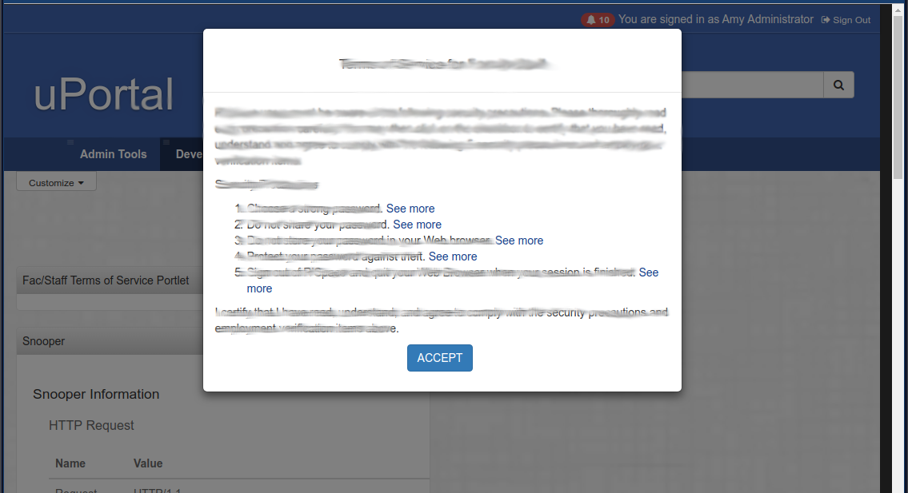

# Modal Notification

Modal Notification is a single notice that will be presented until the user clicks the `Accept` button.
This feature could be used for a Terms of Service pop-up that must be accepted before
accessing the portal.

## Example Terms of Service Configuration



The following configuration example will add a Notification Portlet configured for modal display to the 
pre-content section of the layout. It will be displayed after log-in.

N.B. These changes are to uPortal-start.

### Notice Source

Copy `stateful-notification-response.json` from the Notification Portlet project to
`overlays/NotificationPortlet/src/main/webapp/WEB-INF/classes/tos.json` in uPortal-start.
Some directories will likely need to be created. Edit the file with your desired modal text.
The important part is that the notice file is in the classpath.

### Portlet Definition

Next create a portlet definition file for the modal notice. In this example we will use
`tos.portlet-definition.xml`. Copy `notification.portlet-definition.xml` to `tos.portlet-definition.xml`
in `data/quickstart/portlet-definition`. Edit the file as follows:

1. Change the title, name, fname and description in the 
new file to "Terms of Service" or "ToS" as appropriate
2. Remove the permissions block as this should not be browsable
3. Add portlet preference
    - name is NotificationController.viewName
    - value is modal
4. Replace DemoNotificationService.locations preference
    - new name is ClassLoaderResourceNotificationService.locations
    - new value is your notice file, `tos.json` 
    - simply remove second Demo value
5. Add portlet preference for the duration until the ToS should appear again
    - name is HideNotificationServiceDecorator.hideDurationHours
    - value is 8760 for a year

### Layout Fragment

To have this display for every authenticated user, we will add it to 
`data/quickstart/fragment-layout/authenticated-lo.fragment-layout.xml`. Add the following after the Customize folder:

```xml
        <folder ID="s400" hidden="false" immutable="true" name="Pre Content folder" type="pre-content" unremovable="true">
            <channel fname="tos" unremovable="false" hidden="false" immutable="false" ID="n410"/>
        </folder>
```

This assumes the fname is "tos" for the portlet defined above.
Also, the IDs need to be unique in the layout file.

### Load Data, Deploy and Restart

To effect these changes, start by importing the XML files. Next, deploy Notifications Portlet.

The easiest way to do these is to run `./gradlew portalInit`.

Last, restart Tomcat.